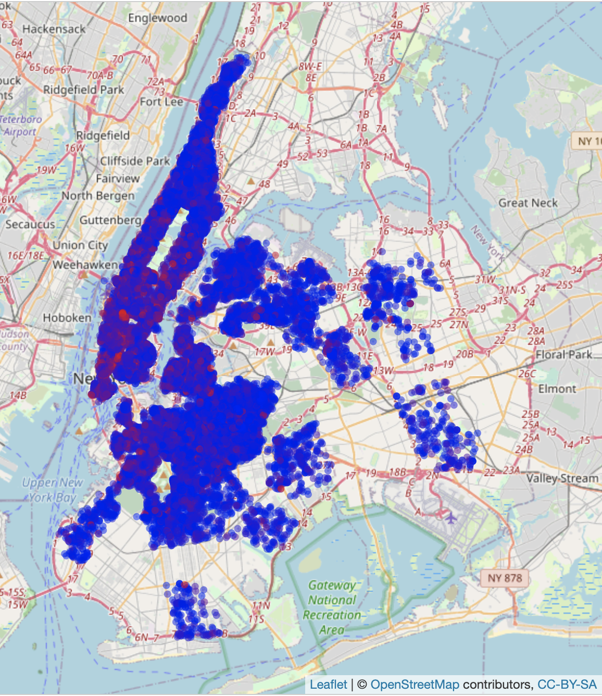
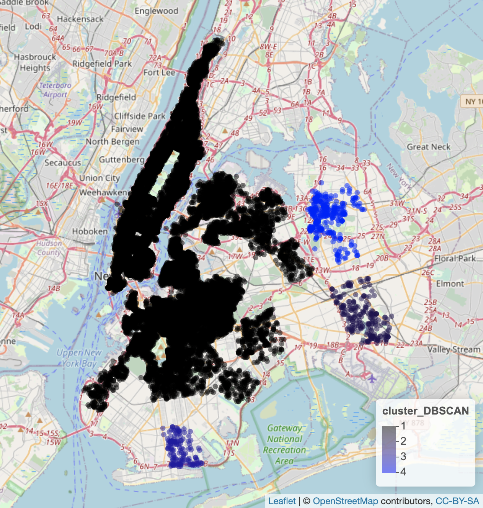
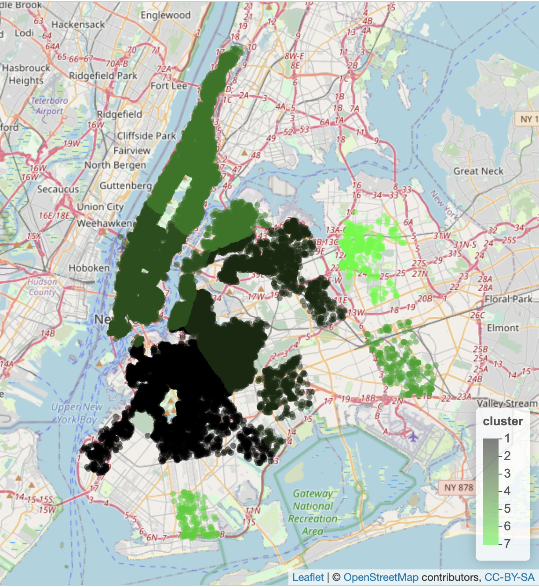
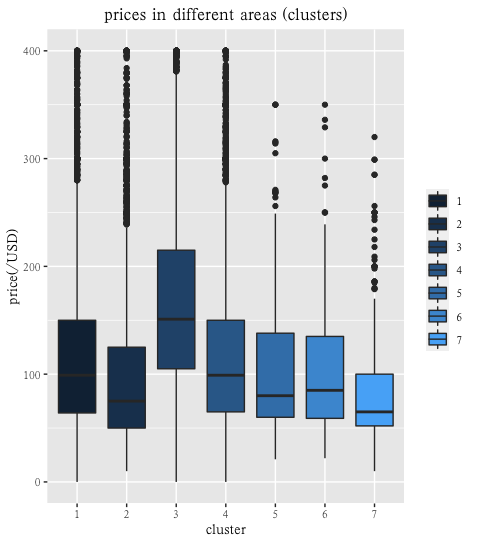

## Clustering and visualization
First we plot a map (Figure1) regarding the relationship between the price and the location of the house to have an intuitive view of the whole, where the red point represents a higher price . We can see that red points mainly gather at south of the central park. 

Then we conduct clustering analysis based on the coordinates (i.e. longitude and latitude) using DBSCAN (Figure2). By DBSCAN we divide the houses into four clusters initially, and we can see that cluster1 is pretty large and there are over 30,000 houses in it. Therefore, we continue to use k-means clustering to further cluster points in initial cluster1. Eventually we get 7 clusters (including 4 k-means clusters in initial cluster1 and remaining 3 clusters) as figure 3 shows. We find that there are obvious differences between the prices of houses of different clusters as the box-plot (figure 4), so we confirm the location of the house effects its price in some way. 

<figcaption>Figure1</figcaption>
<figcaption>Figure2 DBSCAN cluster map</figcaption>
<figcaption>Figure3</figcaption>
<figcaption>Figure4 Boxplot</figcaption>
